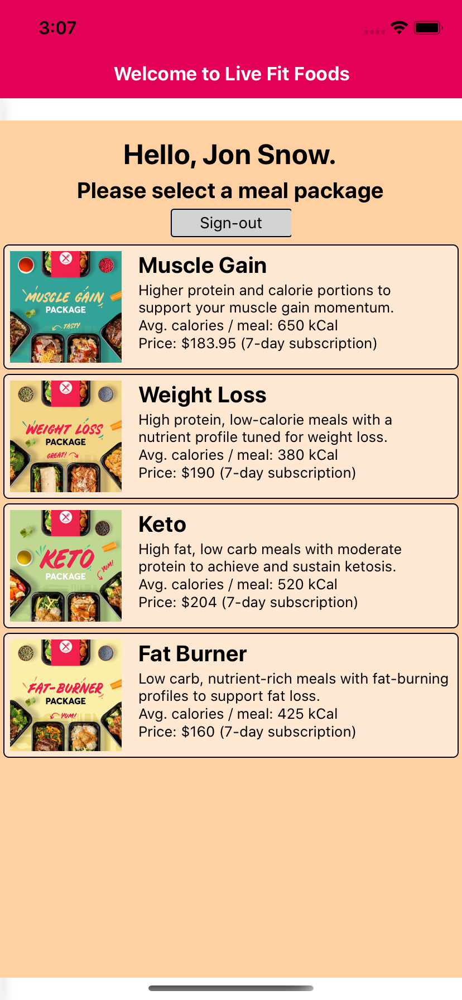
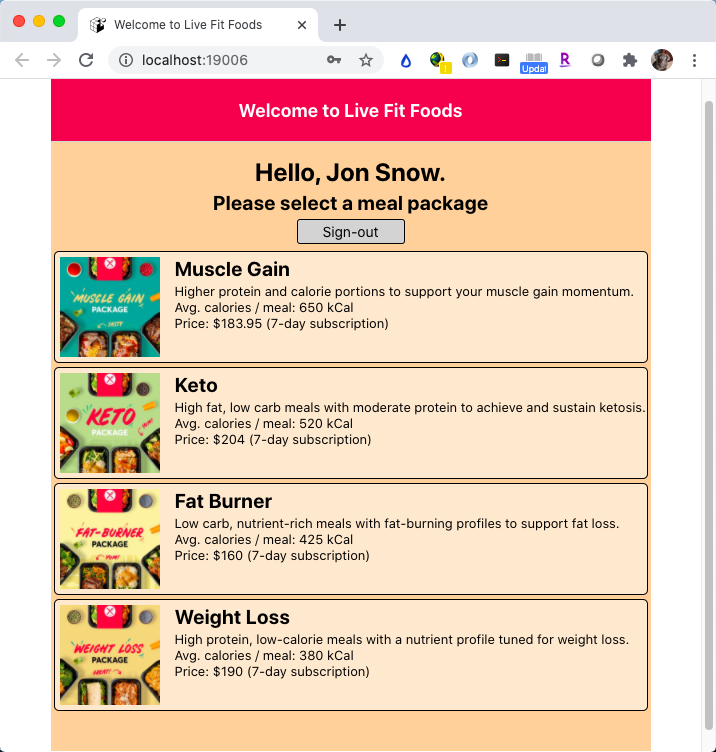

# LiveFitFood-ReactNative

#### Mock ordering app for livefitfood.ca implemented using the React Native framework

#### ***DISCLAIMER: This app was developed as an exercise in React Native hybrid-application development and is not in any way affiliated with the livefitfood.ca website or any of its mobile apps.***

#### Technology/Concepts used
* Function-based components

* Firebase cloud storage development platform for authentication, storage and database operations

* Stack Navigation

* props, routes, navigation for data passing

* FlatList to display items in a list

* Customized child components for mealkit and meal displays

* JSON parsing

#### Android screenshots
            

#### iOS screenshots
            

#### Web screenshots
                    

#### Features

#### Link to specification: <a href="./docs/MAD4008 - Project - Meal Delivery Apps.pdf" target="_blank">[App Specification]</a>
